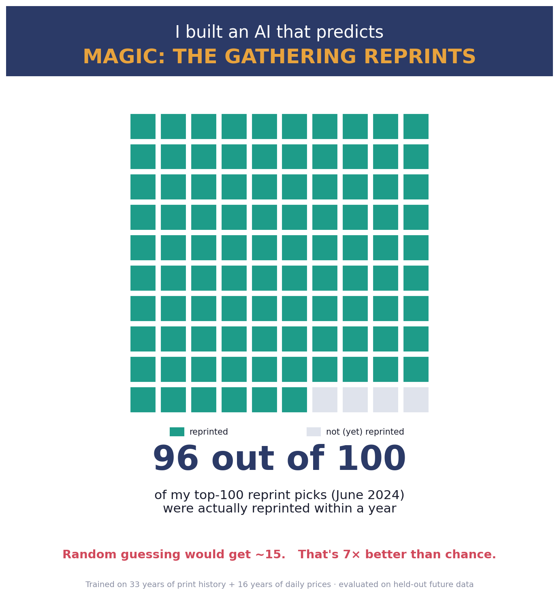

# mtg-reprint-signal

**Daily MTG reprint-risk forecast: cards likely to be reprinted in 3 / 6 / 12 months.**
By Cameraderie Cards. Informational only, not financial advice.

> Part of the **Cameraderie Cards** toolkit: [`mtg-buy-signal`](https://github.com/rnorlund/mtg-buy-signal) · [`mtg-sell-signal`](https://github.com/rnorlund/mtg-sell-signal) · [`mtg-reprint-signal`](https://github.com/rnorlund/mtg-reprint-signal) (you are here)

A survival-analysis model that estimates, for every Magic: The Gathering card,
the probability Wizards of the Coast reprints it in paper within the next 3,
6, and 12 months. Trained on the full Scryfall print history (1993 to 2026)
plus roughly 16 years of daily secondary-market prices and Commander-format
demand. Evaluated strictly on held-out future data the model never saw during
training.

## Headline performance

Held-out test (July 2024 to June 2025):

| Horizon | AUC | Brier score | Base rate |
|---|---|---|---|
| 3 months  | **0.86** | 0.031 | 4.3% |
| 6 months  | **0.85** | 0.042 | 5.8% |
| 12 months | **0.82** | 0.062 | 7.7% |

**Forward test:** taking a snapshot of June 2024 and asking "which 100 cards
are most likely to be reprinted in the next year?" - **95 of the model's top
100 picks were actually reprinted** in the following 12 months, versus a ~15%
base rate. Roughly 6x better than chance. Predictions are calibrated (a card
the model rates 87% likely reprints about 83% of the time).

See [`TechnicalPaper/REPORT.md`](TechnicalPaper/REPORT.md) for the full
methodology, ablation, and limitations.



## The predictions

[`outputs/reprint_risk.csv`](outputs/reprint_risk.csv) is the deliverable, one
row per card:

| field | meaning |
|---|---|
| `reprint_risk_rank` | 1 = highest reprint risk (global rank) |
| `oracle_id` | Scryfall oracle id (stable join key) |
| `name` | English card name |
| `last_printed_at_as_of_snap` | most recent paper printing |
| `n_prior_printings_as_of_snap` | how many times printed so far |
| `price_usd_market` | reference market price at scoring time |
| `p_reprint_3mo` | calibrated probability of reprint within 3 months |
| `p_reprint_6mo` | calibrated probability within 6 months |
| `p_reprint_12mo` | calibrated probability within 12 months |
| `excluded_reason` | e.g. `reserved_list` (these are forced to 0) |

Probabilities are calibrated and monotonic (`p3 <= p6 <= p12`).

## Dated, falsifiable track record

[`track_record/`](track_record/) holds dated, immutable snapshots of past
predictions, each with a SHA-256 manifest so you can check later that we
didn't quietly rewrite history. Anyone can compare a past snapshot against
what actually got reprinted over the following months. That is the point.

## What's in this repo (and what isn't)

| Open here | Held private |
|---|---|
| Methodology + scientific report (PDF / DOCX / Markdown) | Training code and ingest pipeline |
| Predictions (CSV / JSON) | Trained model weights |
| Held-out validation outputs | Raw price-history data (licensed) |
| Coverage audit | Daily refresh infrastructure |

Predictions and the technical report are released; the live pipeline and
trained weights are commercial.

## Disclaimer

See [`DISCLAIMER.md`](DISCLAIMER.md). Short version: these are model
predictions, not insider information, and they do not constitute investment
advice. Reprints are decided by Wizards of the Coast and are not public.

## Citation

If you reference this work:

```
Cameraderie Cards. mtg-reprint-signal: a survival-analysis model for
Magic: The Gathering reprint forecasting. 2026.
https://github.com/rnorlund/mtg-reprint-signal
```

## Sibling repositories

| Repo | Question it answers |
|---|---|
| [`mtg-buy-signal`](https://github.com/rnorlund/mtg-buy-signal) | Which cards are likely to spike upward — when to **buy** |
| [`mtg-sell-signal`](https://github.com/rnorlund/mtg-sell-signal) | Which cards have peaked and are likely to fall — when to **sell** |
| [`mtg-reprint-signal`](https://github.com/rnorlund/mtg-reprint-signal) | Which cards are at risk of being reprinted — when to **brace** |
| [`cameraderie-cards`](https://github.com/rnorlund/cameraderie-cards) | Umbrella landing page |

## License

[CC BY-NC-SA 4.0](LICENSE) on the methodology, report, and predictions data.
Commercial use, redistribution of the prediction stream, or training a
derivative model on these outputs is not permitted without a license.
