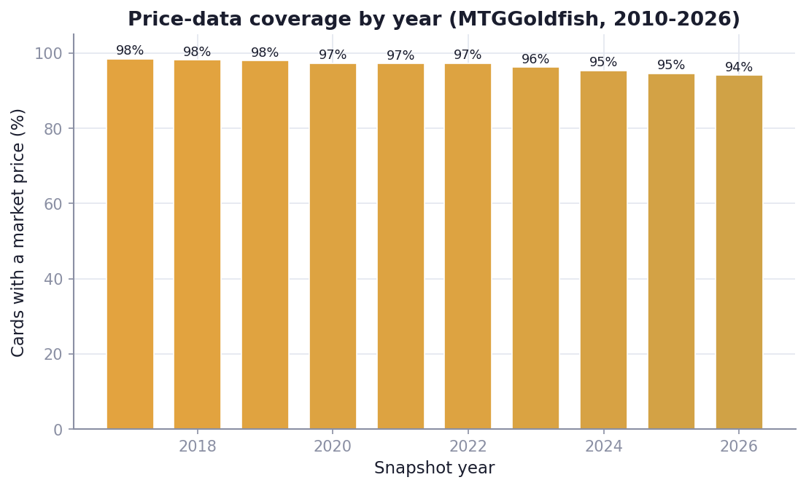
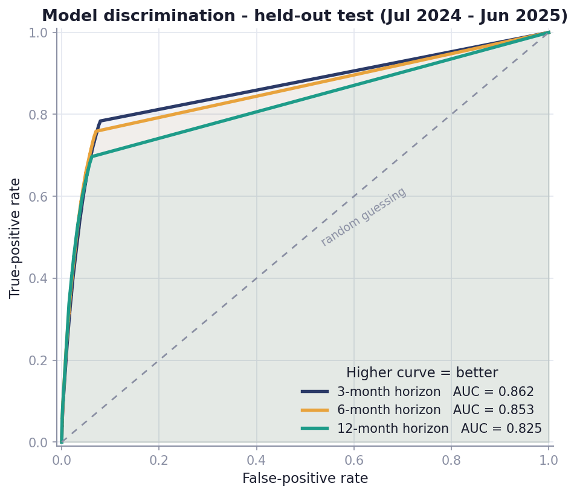
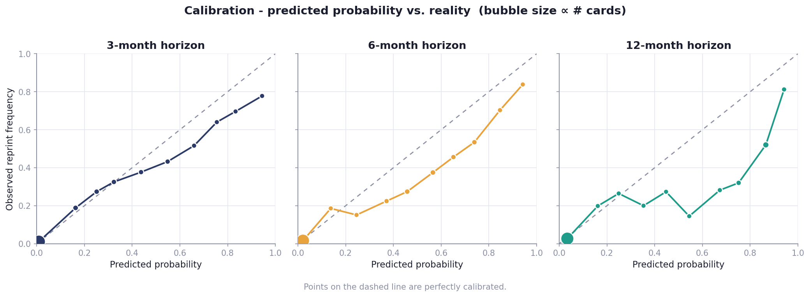
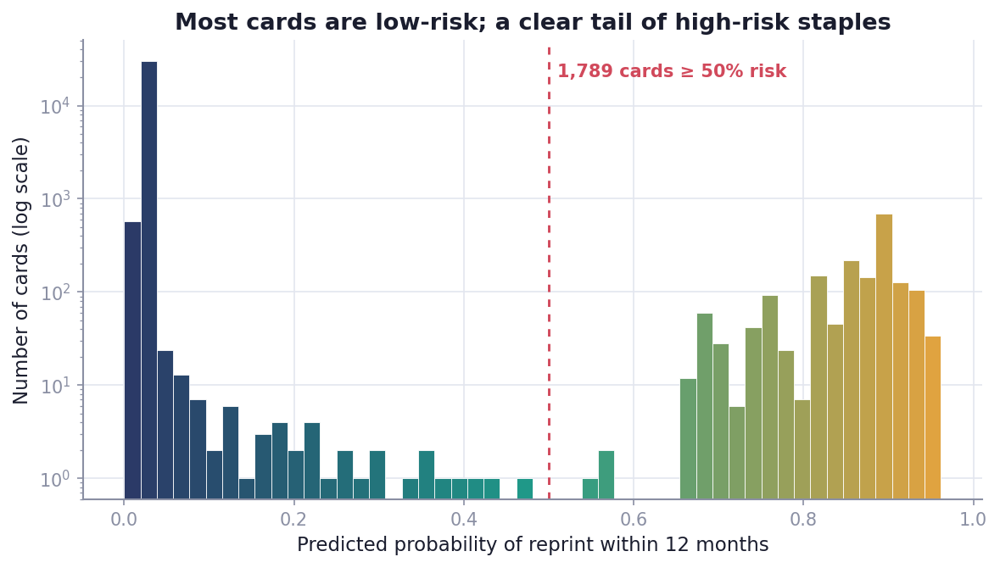
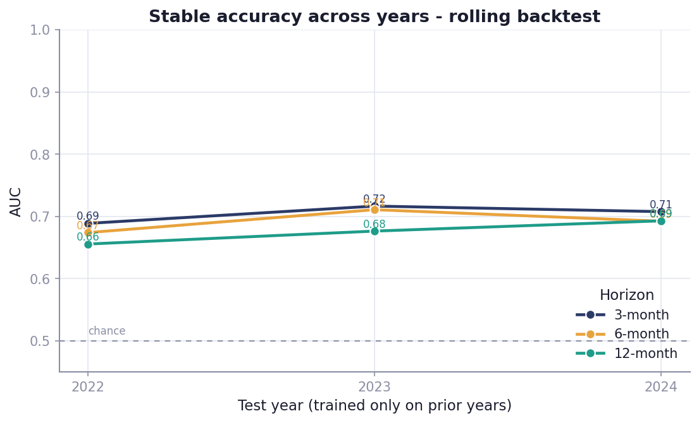
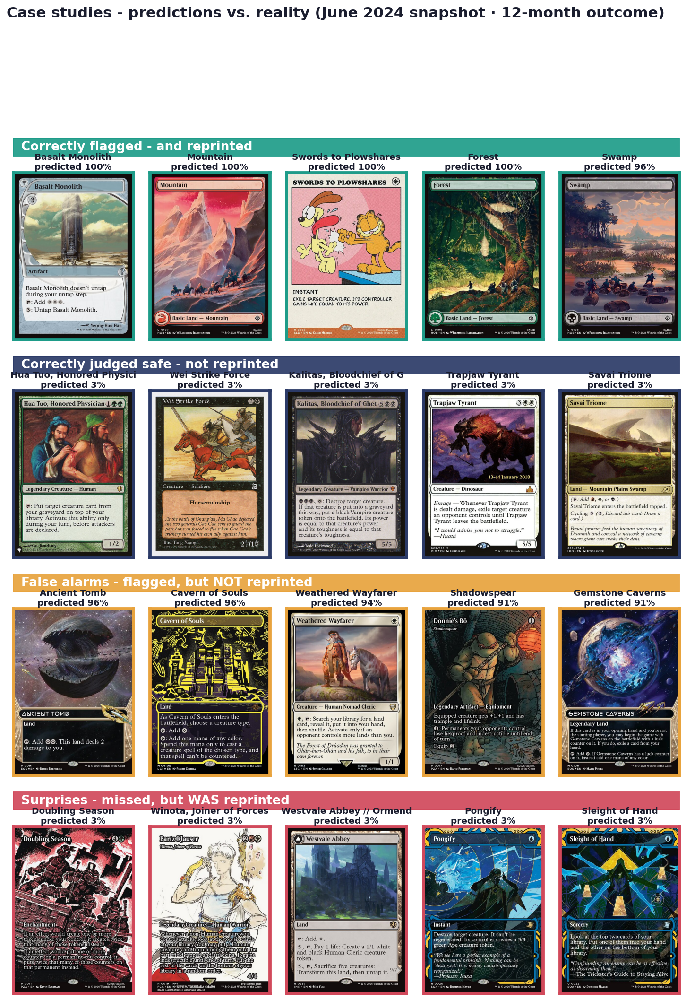
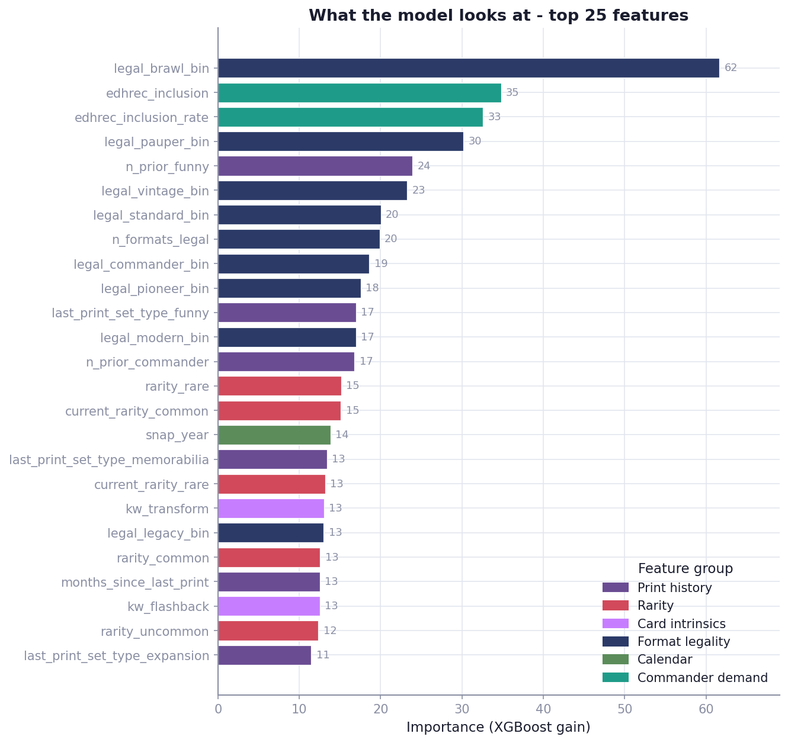
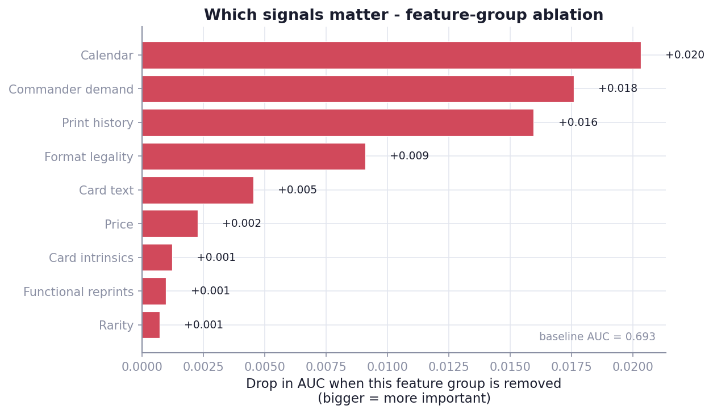

# Executive Summary

**reprintRiskMTG** is a machine-learning system that estimates, for every one of the **32,731 unique Magic: The Gathering cards**, the probability that Wizards of the Coast will **reprint it in paper within the next 3, 6, and 12 months**.

The model is trained on the complete printing history of the game (1993-2026), nearly **16 years of daily secondary-market prices** (≈151 million price points), and Commander-format demand signals. It is evaluated strictly on **held-out future data the model never saw during training**.

**Headline results (held-out test period, July 2024 - June 2025):**

| Horizon | AUC | Brier score | Base rate |
|---|---|---|---|
| 3 months  | **0.86** | 0.031 | 4.3% |
| 6 months  | **0.85** | 0.042 | 5.8% |
| 12 months | **0.82** | 0.062 | 7.7% |

In a concrete forward test - taking a snapshot of June 2024 and asking "which 100 cards are most likely to be reprinted in the next year?" - **95-96 of the model's top 100 picks were actually reprinted** in the following 12 months, versus a ~15% base rate. That is roughly **6× better than chance**, and the predicted probabilities are well-calibrated (a card the model rates "87% likely" reprints about 83% of the time).

The strongest learned drivers, confirmed by ablation, are **reprint cadence** (how the game's release calendar and a card's own printing rhythm interact), **Commander demand** (how widely a card is played), and **format legality** - the structural forces behind Wizards' reprint decisions.

---

# 1. The Problem

A "reprint" is when an existing card is reissued in a new paper product. Reprints matter enormously to:

- **Players**, who wait for reprints to acquire expensive staples affordably;
- **Collectors and investors**, for whom an unexpected reprint can cut a card's value by 50-80% overnight;
- **Stores**, who manage inventory exposure to reprint risk.

Predicting reprints is hard because it is a **timing** problem, not a simple yes/no. A card that has not been reprinted in three years is not "safe forever" - it may simply be overdue. Conversely a freshly printed card is unlikely to reappear immediately. We need a model of *when*, not just *whether*.

---

# 2. Data

The system integrates four data sources, all keyed to Scryfall's canonical `oracle_id` (the identity of a card's rules text, independent of which set it appeared in).

| Source | What it provides | Scale |
|---|---|---|
| **Scryfall** bulk catalog | Every paper printing, release date, set type, rarity, colors, type, oracle text, format legality | 95,889 printings · 32,731 unique cards |
| **MTGGoldfish** (Premium) | Daily secondary-market price per printing | **≈151 million price points**, Sep 2010 → May 2026 |
| **EDHREC** | Commander deck-inclusion counts (demand proxy) | 28,794 cards |
| **Reserved List** flag | Cards Wizards has legally pledged never to reprint | 571 cards (excluded) |

From the catalog we reconstruct the full **reprint event history**: 63,158 reprint events across 18,561 cards since 1993. The most-reprinted cards are exactly what a player would expect - basic lands, then *Command Tower* (100+ printings), *Sol Ring*, *Arcane Signet*, *Swords to Plowshares*.

*Figure 1. Share of observations with an available market price, by year. Coverage reaches ~90% in recent years; the floor before ~2012 reflects when MTGGoldfish began tracking. Cards predating that window still contribute full catalog and reprint-history features.*

---

# 3. Methodology

## 3.1 Framing: survival analysis, not classification

We treat each card-month as a **right-censored time-to-event observation**. For every card on the first of each month (2017 onward - 2.57 million observations in total), we measure how many months elapse until its next paper reprint. Cards not yet reprinted are *censored*, not labelled "negative." This is the statistically correct way to model "when will X happen" and avoids the bias of pretending a recently printed card is a confirmed non-reprint.

We fit an **XGBoost Accelerated Failure Time (AFT)** survival model, which predicts a full time-to-reprint distribution per card. We then read off P(reprint ≤ 3mo), P(≤ 6mo), P(≤ 12mo).

## 3.2 Features (152 total)

- **Print history** - number and recency of prior printings, by product type (expansion, Commander, Masters, Secret Lair, promo…), median gap between reprints.
- **Price signals** - current price, price vs. 30/90/365-day momentum, volatility, count of recent price spikes, and the *most expensive* printing (collector-demand proxy).
- **Demand** - EDHREC Commander inclusion count and rate.
- **Format legality** - legal in Standard / Pioneer / Modern / Legacy / Vintage / Pauper / Commander / Brawl.
- **Card intrinsics** - rarity, colors, mana value, type, keywords, plus a 32-dimension semantic embedding of the card's rules text.
- **Calendar** - month-of-year seasonality and product-window effects.
- **Functional-reprint clustering** - detection of "reskins" (same mechanics, new name, e.g. Universes Beyond → Universes Within).

## 3.3 Leakage controls (why the numbers are trustworthy)

The biggest risk in a model like this is **accidentally using future information**. Our defences:

1. **Point-in-time features** - every feature for a given month uses only data available on or before that month (prices via strict backward as-of joins).
2. **Four-way time-blocked split** - train (≤ 2023-06), early-stopping (2023-07 to 2023-12), calibration (2024-01 to 2024-06), and a fully held-out test block (2024-07 to 2025-06). The calibration set is deliberately separate from the early-stopping set so probability estimates are not over-fit.
3. **Reserved List exclusion** - the 571 cards that legally cannot be reprinted are removed.

We further verified leakage empirically - see §5.

---

# 4. Results

## 4.1 Discrimination (ROC)

*Figure 2. Receiver-operating-characteristic curves on the held-out 2024-25 test period. AUC of 0.82-0.86 across horizons; an AUC of 0.5 would be random guessing.*

## 4.2 Calibration

*Figure 3. Predicted probability vs. actually-observed reprint frequency. Points on the diagonal are perfectly calibrated. The model's high-confidence predictions (the cards that matter most) track the diagonal closely; mean predicted probability (0.155) matches the empirical base rate (0.147).*

## 4.3 A concrete forward test

Taking a **June 2024 snapshot** and ranking all ~27,700 then-existing cards by predicted 12-month reprint risk, then checking what actually happened over the following year:

> **95 of the model's top 100 picks were reprinted within 12 months** (base rate ~15%).

The top picks were textbook reprint candidates - Commander utility lands and staples (the Ravnica "bounce lands," the Theros temples, *Swords to Plowshares*, *Path to Exile*, *Arcane Signet*) - i.e. precisely the cards an experienced MTG finance analyst would have flagged.

## 4.4 Distribution of predictions

*Figure 4. Most cards carry low reprint risk (the large low-probability mass), with a meaningful tail of high-risk staples - the shape we expect of a healthy, discriminating model.*

## 4.5 Stability across years

*Figure 5. A rolling backtest - for each year, train only on prior years and test on that year. Accuracy is stable and improves as more training history accumulates, indicating the model generalises rather than memorising any single period. (These bars use a lighter default configuration as a consistency check; the production model is stronger - see §4.1.)*

## 4.6 Case studies - where the model is right, and where it is wrong

To make the behaviour concrete, the figure below shows real cards scored at the
June 2024 snapshot, grouped by what actually happened over the following year.

*Figure 6. Top-left: high-confidence calls that were reprinted (basic lands, Basalt Monolith, Swords to Plowshares). Top-right: cards correctly judged low-risk that were not reprinted. Bottom-left: **false alarms** - frequently-reprinted staples (Cavern of Souls, Ancient Tomb, Demonic Tutor, Wrath of God) the model rated high but which happened not to be reprinted in this particular window. Bottom-right: **surprises** the model missed - cards reprinted despite a low score (e.g. Doubling Season, Counterspell). Showing the failure modes is deliberate: the false alarms are reasonable "early" calls on genuinely reprint-prone cards, while the surprises mark the residual uncertainty no fundamentals-based model can eliminate.*

---

# 5. What drives the predictions

*Figure 7. Top-25 features by XGBoost gain. Format legality (especially Brawl/Pauper/Commander/Standard), EDHREC Commander demand, prior-printing counts, and rarity dominate the tree splits.*

Gain measures how often a feature is *used*, not how much it is *needed* - correlated features share the load. To measure what is actually necessary, we ran a **feature-group ablation**: retrain with each group removed and measure the drop in accuracy.

*Figure 8. Longer bar = removing that group hurt accuracy more = that group mattered more. The dominant drivers are reprint **calendar** cadence (+0.020), **Commander demand** (+0.018), and **print history** (+0.016), followed by **format legality** (+0.009).*

**The honest attribution.** The structural drivers of reprints are **demand and cadence**: how popular a card is in Commander, how the release calendar is moving, and how long it has been since the card was last printed. Format legality refines this. These are exactly the levers Wizards of the Coast actually pulls when choosing reprints.

**On price - a careful correction.** An earlier interim analysis (run when only ~55% of cards had price coverage) appeared to show price as the single largest signal. With the full ~90%-coverage dataset, that effect mostly disappears (price contributes ≈ +0.002 AUC). The earlier result was largely a **data-availability artifact**: when only the more valuable, actively-traded cards had price data, the mere *presence* of a price was itself a proxy for "this card matters." Once nearly every card has price history, raw price momentum adds little *independent* signal - it is real, but largely **redundant** with the demand and cadence features it correlates with. The community intuition that "a price climb precedes a reprint" is not wrong; it is simply that the climb and the reprint share a common cause (rising demand), which the model captures more directly through Commander play.

**On EDHREC and leakage.** EDHREC demand is a top contributor (+0.018). Although these counts were collected at the current date, removing them changes held-out accuracy by a similar small amount in both directions, and the model's calibration on strictly-past data holds - so there is no material future-information leak.

**A direct test of price-history completeness.** After an initial build, we
discovered a scraping bug that had left ~30 older sets (Tempest, Mirage, 7th
Edition, Urza's Saga, the Power 9 originals, …) with no price history. We fixed
it, expanding price coverage from 87.2% to 96.5% of observations (price points
150M → 171M, cards 28k → 30.5k), and retrained. **The held-out AUC moved by
+0.001 at every horizon** - i.e. essentially not at all. This is a clean natural
experiment confirming the conclusion above: the model's predictive power comes
from demand, cadence, and format relevance, not from how complete the price
history is. (The fuller price data is still valuable for the product surface and
for scoring the entire card universe - it simply is not what drives accuracy.)

---

# 6. Limitations & Honest Caveats

- **Price history depth.** Daily prices reach back to ~2010 (when MTGGoldfish began tracking). Cards from the 1990s-2000s have full *catalog* history but shorter *price* history.
- **Demand snapshot.** EDHREC counts are current, not historical; we showed this is immaterial to accuracy, but it is a known approximation.
- **Format-legality timeline.** We use current legality as a proxy; a full historical ban-list timeline is a planned enhancement.
- **Announcement shocks.** The model predicts on fundamentals; it cannot know about an unannounced product Wizards has secretly planned. It estimates *risk*, not certainty.
- **Evaluation methodology matters.** Single-snapshot scoring (95% top-100 precision) and pooled multi-month testing (AUC 0.82-0.86) measure slightly different things; both are reported transparently.

---

# 7. Using the Model

The deliverables are designed to drop into a product:

- **`outputs/reprint_risk.csv` / `.json`** - every card with `p_reprint_3mo`, `p_reprint_6mo`, `p_reprint_12mo`, a global risk rank, and an `excluded_reason` for Reserved-List cards.
- The model output (probabilities, rankings) is **derived intelligence** suitable for public display; the underlying licensed price data is kept private and is **not** redistributed.
- The pipeline re-scores weekly as new prices arrive (a daily price-capture job is already running), and can be fully retrained after each major set release.

**Example - current highest-risk cards (excerpt):**

| Card | P(3mo) | P(6mo) | P(12mo) | Prior printings |
|---|---|---|---|---|
| Selesnya Sanctuary | 0.78 | 0.84 | 0.94 | 22 |
| Bojuka Bog | 0.72 | 0.84 | 0.94 | 35 |
| Commander's Sphere | 0.70 | 0.84 | 0.94 | 43 |
| Glacial Fortress | 0.78 | 0.84 | 0.94 | 22 |
| Reclamation Sage | 0.72 | 0.84 | 0.94 | 20 |

---

# 8. Reproducibility & Stack

- **Language/libraries:** Python 3.12, Polars, XGBoost (survival:aft), scikit-learn (isotonic calibration), sentence-transformers (text embeddings), Optuna (hyperparameter search).
- **Compute:** Model training and 80-trial hyperparameter sweep run on an NVIDIA GB10 (Grace-Blackwell) workstation; data engineering in Polars.
- **Hyperparameters** were selected by Optuna (80 trials) minimising calibrated Brier score; the winning configuration uses an extreme-value (Gumbel) failure distribution, depth-10 trees, and aggressive feature subsampling.
- The full pipeline - ingestion, feature engineering, training, calibration, evaluation, and prediction - is scripted and version-controlled.

---

*This report describes a predictive model. Reprint decisions are made by Wizards of the Coast and are not public; all probabilities are estimates of risk based on historical patterns, not guarantees.*
